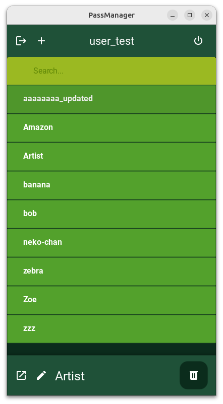
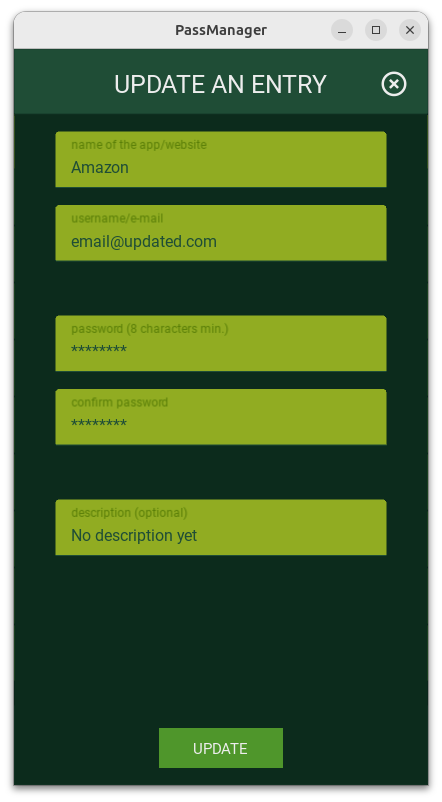
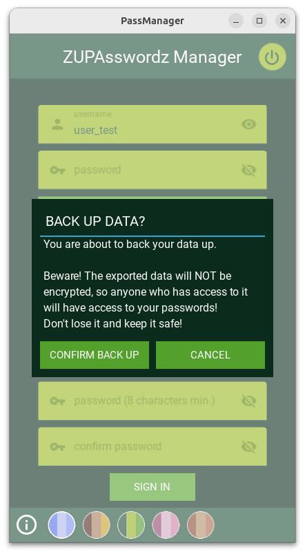
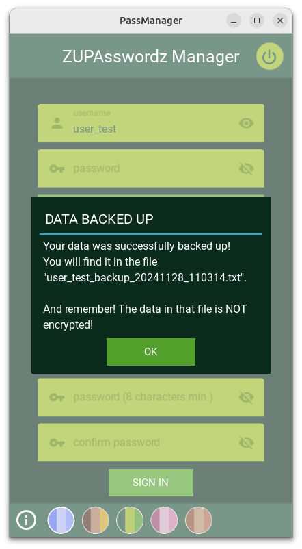

*last updated on April 5, 2025 - Python 3.10.9*

# ZUPAsswordz Manager - Because online data leak is not a fun trend (really, stop it, fuckerz...)
- *Tested on Windows 10 and Python 3.10.2* -> OK
- *Tested on Ubuntu 24 and Python 3.10.9* -> OK
- *Tested on Android 14* UP1A (Samsung S22, One UI 6.0) -> OK
- *Tested on Android 12* (Samsung S22, One UI 4)* -> OK
- *Tested on Android 11 (Redmi Note 8 Pro, MIUI Global 12.5.8)* -> OK
- *Tested on Android 9 (Samsung S9)* -> not OK, see "issues" below

# Issues
- Android 9: permissions issues (?): refuses to write (to export the data) despite granted permissions

# What's new?
- April 5 (still beta version): re-worked the way to export and import backup. Because Kivy (actually Python4Android) is NOT compatible with pycryptodome/pycryptodomex nor py7zr nor anything else that would've allowed me to create a password-protected ZIP/7z file (works on Linux/Windows...), I had to rethink how to safely backup the user's data. So now everything is encrypted upon exporting with a password of the user's choice into a TXT file.
Importing works in TWO ways: 1) choose a backed up file, which requires the user to enter the right password, or 2) choose a normal file (data in clear) written in a pre-defined pattern (refer to the doc once it's available), no password necessary.

# Preview (2024/11/28) (outdated)

 

 

# Pre-requisites
- Later...
