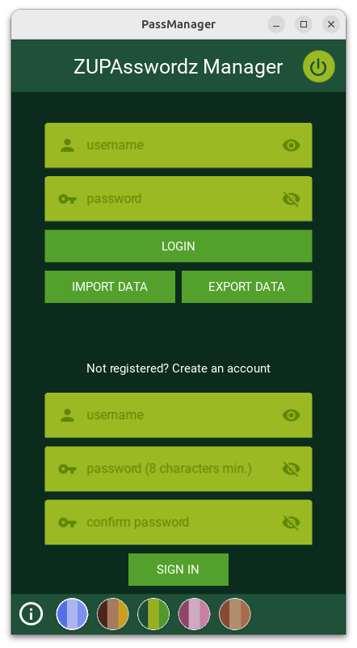

*last updated on November 28, 2024 - Python 3.10.9*

# ZUPAsswordz Manager - Because online data leak is not a fun trend (really, stop it, fuckerz...)
- *Tested on Windows 10 and Python 3.10.2* -> OK
- *Tested on Ubuntu 24 and Python 3.10.9* -> OK
- *Tested on Android 14* UP1A (Samsung S22, One UI 6.0) -> not OK, see "issues" below
- *Tested on Android 12* (Samsung S22, One UI 4)* -> not OK, see "issues" below
- *Tested on Android 11 (Redmi Note 8 Pro, MIUI Global 12.5.8)* -> not OK, see "issues" below
- *Tested on Android 9 (Samsung S9)* -> not OK, see "issues" below

# Issues
- Android 14: impossible to get storage access (permissions denied without even asking)
- Android 12 and 11: code issue, cannot get the URI of the file to import (from "Documents", in my case)
- Android 9: same as Android 11 and 12, and refuses to write (to export the data) despite granted permissions

# Preview
 
 

# Pre-requisites
- Later...
